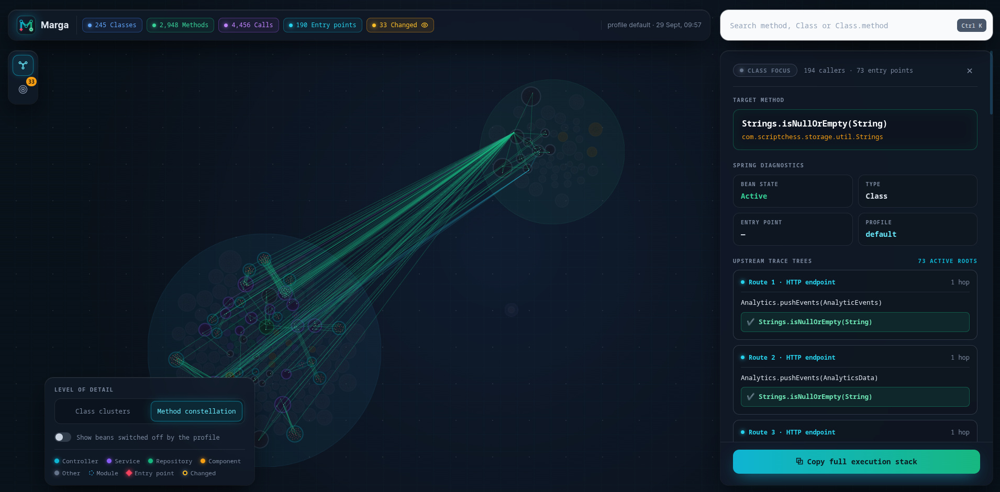
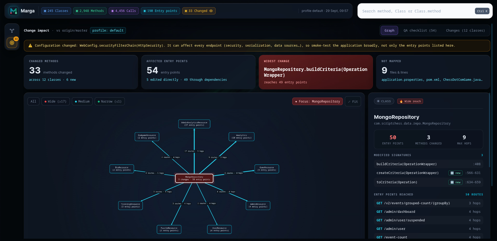
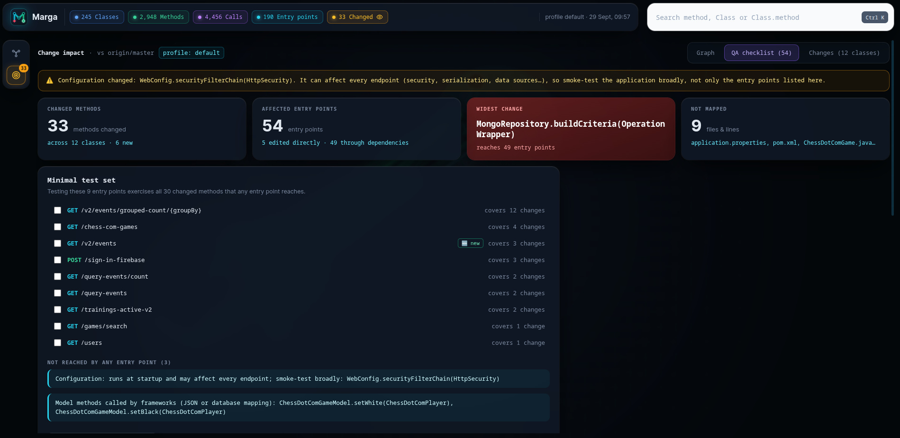
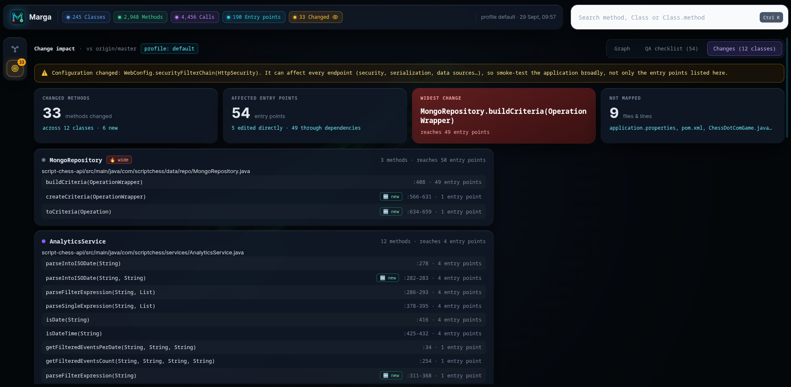

# Marga Maven Plugin

**Marga** (Sanskrit for *path*) scans the compiled classes of a Maven project — including every
module in a multi-module reactor — and generates a **self-contained interactive HTML report** with
two views: a **method graph explorer** for the whole call graph, and — when you also hand it a git
diff — an **interactive change impact report** showing which entry points and methods your
uncommitted or branch changes affect, plus a ready-to-run QA checklist.

It works directly on compiled `.class` bytecode (via [ASM](https://asm.ow2.io/)), so it needs no
source parsing, no running application, and no special compiler setup — just `mvn compile` output.

## Features

- **Static call graph** of all compiled classes across all reactor modules — direct calls,
  lambda/method-reference calls, and virtual dispatch edges are distinguished.
- **Spring-aware**: recognizes `@Controller`, `@Service`, `@Repository`, `@Component`,
  `@Bean` methods, constructor/field injection, interfaces and overrides, and local/anonymous
  classes (lambda bodies are attributed to their enclosing method).
- **Profile-aware**: evaluates Spring `@Profile` expressions (`prod`, `!prod`,
  `dev & (eu | us)`, `|`, `&`, parentheses) and marks beans as active, inactive, or conditional
  for the active profile set.
- **Two views in one report** — a rail on the left switches between the **Explorer** (the whole
  call graph) and the **Change impact** page; it is a [Cytoscape.js](https://js.cytoscape.org/)-based
  viewer with search, overview and light/dark theme, fully self-contained and openable via `file://`.
- **Modularized explorer** — in a multi-module reactor every Maven module's classes and methods are
  drawn inside a labelled module circle (one hue per module, with the class count). Module circles
  are positioned by the calls between them and carry their nodes when dragged, so cross-module
  traffic is visible at a glance.
- **Interactive impact view** — opens automatically when a diff was analyzed (the rail button shows
  a badge with the number of changed methods) and has three tabs: **Graph**, **QA checklist** and
  **Changes**. KPI cards summarize the blast radius (changed methods/classes, affected entry points,
  widest change, unmapped files), and a focusable impact graph shows which entry points each change
  reaches and in how many hops, with an inspector for the selected class or method.
- **QA checklist** — computes a *minimal test set*: the fewest entry points that still exercise every
  changed method any entry point can reach, each row labelled with how many changes it covers and
  with its trigger (e.g. `GET /v2/events`). It also calls out changed code that **no** entry point
  reaches (configuration/startup beans and framework-instantiated model methods), because those
  need broad smoke testing instead of a targeted curl.
- **Shareable deep links** — the report reflects the current view in the URL hash
  (`#impact`, `#method=<id>`, `#class=<id>`), so any focus state can be bookmarked or shared,
  and the browser's Back/Forward buttons navigate report views.
- **Change impact analysis** — map a git diff onto changed methods, resolve the trigger of every
  entry point (HTTP verb + path, `cron:`, `topics:`, `queues:`, listener destination, …) and walk
  callers to compute the impact radius. Results are shown in the report and emitted as
  `impact.json` / `impact.md` for CI pipelines and pull-request comments.
- **Large-codebase friendly** — the graph is stored in compact array-based form and the report
  data is chunked and loaded lazily, so it scales to big codebases.

## Requirements

- **JDK 17+** (the plugin itself is compiled with `--release 17`)
- **Apache Maven 3.9.0+**
- **Git 2.30+** — only for impact analysis with `-Dmarga.diffBase` (needed for `--merge-base`)

## Getting started

Marga is published to [Maven Central](https://central.sonatype.com/artifact/com.scriptchess/marga-maven-plugin),
so add it as a build plugin in the project you want to analyze:

```xml
<plugin>
  <groupId>com.scriptchess</groupId>
  <artifactId>marga-maven-plugin</artifactId>
  <version>1.1.0</version>
</plugin>
```

> **Important — declare it in the root POM.**
> Marga's goal is an **aggregator goal**: declare it in the **root (parent/aggregator)
> `pom.xml`** of your project, not in a child module. The goal iterates over *every* module of
> the reactor (`session.getProjects()`) and scans each module's compiled classes into a single
> graph, so it needs the root project's view of the build. It is also always invoked once per
> reactor, and all paths it resolves are relative to the **execution root** — the report is
> written to the root `target/marga/`, not a module's own `target/`.
>
> For the same reason, **run it from the root** — execute `mvn ... marga:graph` in the directory
> that holds the root POM — so the whole reactor is available and the working directory used for
> `git diff` is the repository root rather than a submodule.

Then run it:

```bash
mvn compile marga:graph
```

(`mvn install marga:graph` also works, but compiling is all it needs. If the short `marga:`
prefix isn't resolved, either add `<pluginGroup>com.scriptchess</pluginGroup>` to your
`settings.xml` or invoke the goal fully qualified:
`mvn compile com.scriptchess:marga-maven-plugin:1.1.0:graph`.)

Open the generated report:

```
target/marga/index.html
```

A complete root-POM setup with the plugin configured looks like this:

```xml
<project>
  <!-- ... -->
  <build>
    <plugins>
      <plugin>
        <groupId>com.scriptchess</groupId>
        <artifactId>marga-maven-plugin</artifactId>
        <version>1.1.0</version>
        <configuration>
          <!-- all optional; also settable from the command line, e.g. -Dmarga.diffBase=origin/main -->
          <diffBase>origin/main</diffBase>
          <outputDirectory>${project.build.directory}/marga</outputDirectory>
          <skip>false</skip>
        </configuration>
      </plugin>
    </plugins>
  </build>
</project>
```

## How to use

### 1. Run the scan

From the root of your project (single- or multi-module — every reactor module is scanned):

```bash
mvn compile marga:graph
```

Marga parses the compiled `.class` files of each module, builds the call graph and writes the
report to `target/marga/`. Then open `target/marga/index.html` in a browser — no web server
needed, it works straight from the filesystem.

### 2. Explore the report

The report is a single page with two views, switched from the rail on the far left (the badge on the
impact icon is the number of changed methods). Usage is unchanged — open `index.html` and start
clicking.

**Explorer** — the whole call graph:

- **Search anything** — press <kbd>Ctrl</kbd>+<kbd>K</kbd> and type a method, class, or
  `Class.method` name.
- **Inspect a method** — click any node to see its callers, callees, and which entry points
  (controllers, `@Scheduled` jobs, listeners, …) it can be reached from.
- **Switch granularity** — toggle between *Class clusters* and *Method constellation* views in
  the bottom-left control panel.
- **Read the modules** — when the project is a multi-module reactor, each Maven module's nodes are
  grouped inside its own labelled circle (module name · class count, one colour per module), so you
  can see at a glance which module depends on which. Clicking a circle fits it on screen; dragging it
  takes its classes and methods along.
- **Consider profiles** — beans switched off by the current Spring profile are hidden by
  default; enable *Show beans switched off by the profile* to include them.

**Change impact** — only present when a diff was analyzed, and the view the report opens on. It has
three tabs:

- **Graph** — KPI cards for the blast radius, plus the impact graph: changed classes in the middle,
  the classes holding the entry points they reach around them, edges labelled like `7 routes · 5 hops`,
  and filters for *All* / *Wide (≥17)* / *Medium* / *Narrow (≤1)* reach. Selecting a class opens its
  methods, modified signatures and reached routes in the inspector on the right.
- **QA checklist** — the minimal test set (the fewest entry points that still cover all reachable
  changes), each row showing how many changes it covers, followed by the changes that no entry point
  reaches.
- **Changes** — every changed class with its file path, the changed methods with their line ranges,
  `new` badges for added methods, and how many entry points each one reaches.

In **both** views:

- **Share a view** — every focus state is reflected in the URL (`#method=<id>`, `#class=<id>`,
  `#impact`), so you can link colleagues straight to a method or straight to the impact page, and the
  browser Back button navigates between views.

### 3. Check the impact of your changes

Marga's impact analysis needs a diff. You provide it in one of two ways, controlled by two
properties:

| Property         | What it does                                                                                  | Needs git? |
|------------------|-----------------------------------------------------------------------------------------------|------------|
| `marga.diffBase` | A git ref (branch, tag, commit, `origin/main`, `HEAD~3`, …). Marga runs `git diff --merge-base <ref>` itself, comparing that ref's **merge base** against your **working tree**, so **committed and uncommitted changes are both included**. | Yes — and **git 2.30+** for `--merge-base`. |
| `marga.diffFile` | Path to an **already-produced unified diff** file. Marga reads it instead of running git, so this works with no git repo present (e.g. a `.patch` generated by CI or GitHub's API). The file name is shown as the comparison label in the report. | No. |

Only one is needed; if **both** are supplied, `marga.diffFile` takes precedence. With neither,
Marga just writes the call-graph report and skips impact analysis.

#### Via the command line

```bash
# diffBase: compare your working tree against a git ref
mvn compile marga:graph -Dmarga.diffBase=origin/main

# any ref works: a tag, a commit sha, or a relative ref
mvn compile marga:graph -Dmarga.diffBase=v1.4.0
mvn compile marga:graph -Dmarga.diffBase=HEAD~3

# diffFile: use a pre-generated unified diff instead
git diff origin/main > changes.patch
mvn compile marga:graph -Dmarga.diffFile=changes.patch

# absolute paths are fine too
mvn compile marga:graph -Dmarga.diffFile=/tmp/ci/changes.patch
```

The diff file must be a **unified diff** (the default `git diff` format; `--unified=0` is applied
automatically when Marga runs git itself). Context-only or `--stat` output cannot be mapped.

#### Via `pom.xml`

Configure it once in the root POM so the goal picks it up whenever it runs:

```xml
<plugin>
  <groupId>com.scriptchess</groupId>
  <artifactId>marga-maven-plugin</artifactId>
  <version>1.1.0</version>
  <configuration>
    <!-- one of the two; remove the one you don't use -->
    <diffBase>origin/main</diffBase>
    <diffFile>${project.basedir}/changes.patch</diffFile>
  </configuration>
</plugin>
```

Because the parameters are declared with `property = "marga.diffBase"` / `marga.diffFile`,
**command-line `-D` values always override the POM**. That makes a good default possible: pin a
baseline in the POM and override it per run, e.g.

```bash
mvn compile marga:graph -Dmarga.diffBase=release/2.3      # overrides the POM's value
```

#### What you get

The report opens directly on the **impact view**: KPI cards for the blast radius, the impact graph of
changed classes and the entry points they reach, a **QA checklist** with the minimal test set, and a
**Changes** tab that lists every changed class and method with its line range and reach. The same
information is written machine-readably to `target/marga/impact.json` and `target/marga/impact.md`
for CI and PR comments.

### 4. Automate it in CI

Because Marga only needs compiled classes and an optional diff, it fits into any pipeline:

```bash
# e.g. GitHub Actions, inside a PR build
- run: mvn compile marga:graph -Dmarga.diffBase=origin/${{ github.base_ref }}
- run: cat target/marga/impact.md >> $GITHUB_STEP_SUMMARY   # or post it as a PR comment
```
Tip: to annotate a PR from a different job or workflow, create the diff once
(`git diff origin/main > changes.patch`), pass it with `-Dmarga.diffFile=changes.patch`, and
attach `impact.json` / `impact.md` as build artifacts.

If you want to use base branch to calculate impact then include `fetch-depth: 0` in your CI checkout step so that the merge base can be computed correctly.

```
   - uses: actions/checkout@v4
     with:
       fetch-depth: 0
```

### 5. Handy recipes

| I want to…                                     | Do this                                                                 |
|------------------------------------------------|-------------------------------------------------------------------------|
| Understand how a request is handled internally | Run `mvn compile marga:graph`, search the controller method, follow its callers/callees. |
| Know if my uncommitted work is safe            | `mvn compile marga:graph -Dmarga.diffBase=origin/main`                  |
| Know which endpoints to retest after a change  | Same command, then open the impact view → **QA checklist** (minimal test set). |
| Review someone else's PR                       | `git diff main...pr-branch > pr.patch && mvn compile marga:graph -Dmarga.diffFile=pr.patch` |
| Skip the analysis on jobs that don't need it   | `mvn compile marga:graph -Dmarga.skip=true`                             |

All `-Dmarga.*` properties are listed in [Configuration](#configuration).

## Results

Marga's interactive report visualizes the call graph and the change impact across one page. The rail
on the left switches between the two views; within the impact view there are three tabs.

### 1. Explorer

The full call graph, live whenever nothing is selected — classes and methods with their Spring
stereotype, entry points, and the connections between them. In a multi-module reactor, each Maven
module gets its own labelled circle (here `Module` in the legend), so cross-module calls and the
upstream trace of a selected method are easy to follow; the inspector on the right lists the route
trees that reach it and can copy the full execution stack.



### 2. Impact graph

The default view when a diff is available (based on `marga.diffBase` / `marga.diffFile`). KPI cards
report the changed methods and classes, the affected entry points, the widest change and the files
that could not be mapped onto code. The graph puts the changed classes in the middle and, around
them, the classes holding the entry points they reach — each edge labelled with its routes and hops
(e.g. `17 routes · 5 hops`), with reach filters (*All* / *Wide* / *Medium* / *Narrow*). Selecting a
class reveals its modified signatures and the routes that reach it.



### 3. QA checklist

Turns the impact into a test plan: the **minimal test set** — the fewest entry points that together
cover every changed method any entry point can reach — each row showing how many changes it covers
and marking new methods. Below it, the changes that **no** entry point reaches (configuration and
startup beans, framework-instantiated model methods) are listed as a warning to smoke-test broadly.



### 4. Changes

The exhaustive list behind the KPIs: every changed class with its file path, the number of changed
methods and how many entry points it reaches, then each method with its line range and a `new` badge
for added methods.



## Change impact analysis

Impact analysis is driven by `marga.diffBase` or `marga.diffFile` — see
[Check the impact of your changes](#3-check-the-impact-of-your-changes) for how to set each of
them (command line or POM) and how they differ. When a diff is provided, Marga:

1. maps each changed line onto the method(s) that own it (lambda bodies count as their enclosing
   method; blank/comment lines are ignored);
2. walks the caller graph from every changed method to compute the impact radius;
3. resolves the trigger of every affected entry point, so the report can label it
   (`GET /admin/user`, `cron: 0 0 * * * *`, `topics: orders`, …) instead of just showing a method name;
4. renders the interactive report on the **Change impact** view — impact graph, KPI summary,
   reach-ranked changes and the QA checklist (minimal test set + changes no entry point reaches);
5. writes `impact.json` and `impact.md` next to the report for CI consumption and PR comments.

Without `-Dmarga.diffBase` / `-Dmarga.diffFile`, only the call graph report is generated.

## Configuration

All properties are optional and can be set either as `<configuration>` entries in the root POM
(element name = property name, e.g. `<diffBase>`) or on the command line with `-D` (e.g.
`-Dmarga.diffBase=origin/main`). Command-line values override the POM.

| Property                | Default                            | Description                                       |
|-------------------------|------------------------------------|---------------------------------------------------|
| `marga.outputDirectory` | `${project.build.directory}/marga` | Where the report and data files are written.      |
| `marga.skip`            | `false`                            | Set to `true` to skip execution.                  |
| `marga.diffBase`        | —                                  | Git ref to diff against (e.g. `origin/main`). Runs `git diff --merge-base`; see [Check the impact of your changes](#3-check-the-impact-of-your-changes). |
| `marga.diffFile`        | —                                  | Path to a unified diff file instead of running `git diff`; takes precedence over `diffBase`. |

## Output layout

```
target/marga/
├── index.html          the report: Explorer + Change impact views
├── scan.json           raw scan result (debug output)
├── impact.json         impact analysis result (only with a diff)   [JSON, for CI]
├── impact.md           same impact, rendered as Markdown         [for PR comments]
└── data/
    ├── manifest.js     counts, chunk index, format version
    ├── core.js         graph topology + modules (always loaded)
    ├── search.js       method names for search
    ├── overview.js     class-to-class call counts (lazy)
    ├── sig-NNN.js      parameter lists per package group (lazy)
    └── impact.js       changed methods, entry points and routes (only with a diff)
```

The data files are plain `<script>` payloads, so the report works when opened directly from the
filesystem — no web server required.

## How it works

1. **Scan** — `MargaClassFileScanner` walks each module's `target/classes` and parses every
   `.class` file with ASM (`MargaClassVisitor` / `MargaMethodVisitor`), collecting the class
   hierarchy, annotations, `@Profile` values, source-file mappings and per-method call sites.
2. **Build** — `CallGraphBuilder` resolves call sites into a compact, array-based `CallGraph`
   record with forward/reverse edges, override/implementation links, class-level edge pairs and the
   module each class belongs to (drives the module circles in the explorer). Spring bean stereotypes,
   profile activity and entry-point triggers (`EntryRoutes`) are resolved here.
3. **Analyze** (optional) — `ImpactAnalyzer` maps diff lines onto methods, walks reverse (caller)
   edges to find the impact radius, and ranks entry points and changes by reach.
4. **Report** — `ReportWriter` renders everything into the HTML template with embedded
   Cytoscape.js, chunked and lazily loaded data files. `ImpactFormatter` turns the impact into the
   report's KPI/graph/checklist data, the Markdown QA checklist (`impact.md`) and `impact.json`.

## Development

```bash
mvn install        # build, run tests, install locally
mvn -Prelease clean deploy   # sources + javadoc + GPG signing, publish to Maven Central
```

Releases are automated: pushing a `v*` tag (e.g. `v1.1.0`) triggers the
[release workflow](.github/workflows/release.yml), which builds, signs and deploys the plugin
to the Central Portal.

Project layout:

```
src/main/java/com/scriptchess/marga/
├── mojo/       Maven goal (marga:graph)
├── scanner/    class-file discovery
├── visitors/   ASM class/method visitors
├── scan/       scan result model (classes, methods, call sites)
├── graph/      call graph construction (records, profiles, entry routes, modules)
├── impact/     git diff + change impact analysis
└── report/     HTML report generation (viewer template, impact report/checklist, impact.json/.md)
```

## Status

`1.1.0` — published to Maven Central. See the
[release notes](https://github.com/kgcorner/marga/releases) for changes between versions.

## License

[Apache License 2.0](https://www.apache.org/licenses/LICENSE-2.0)