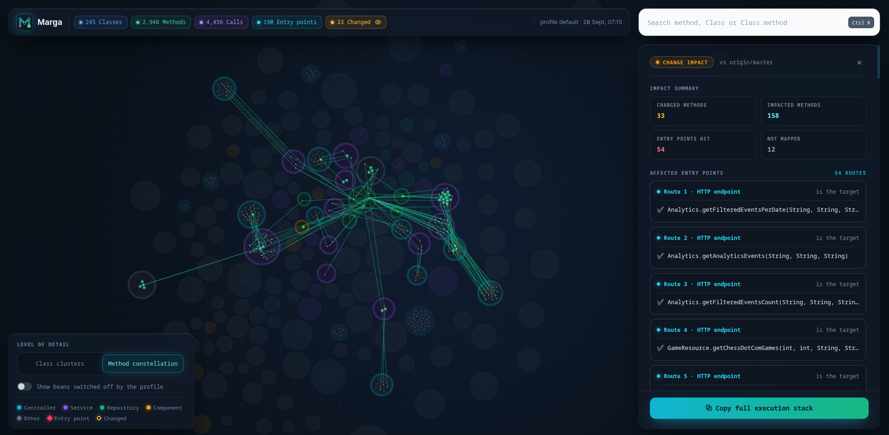
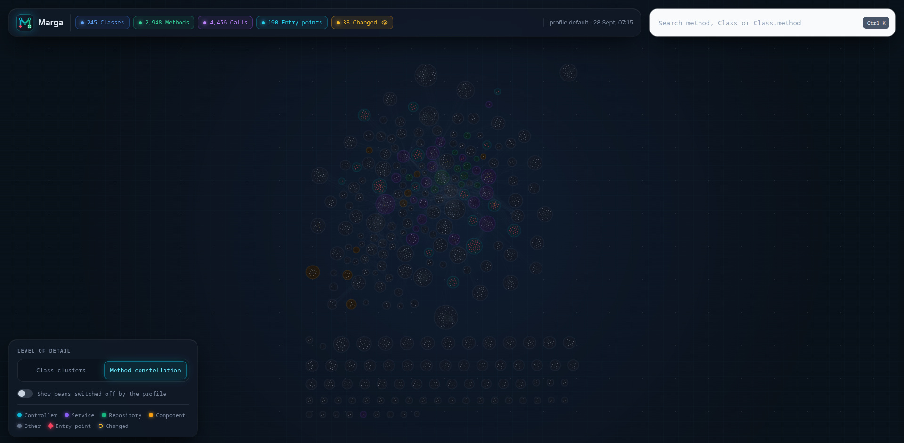
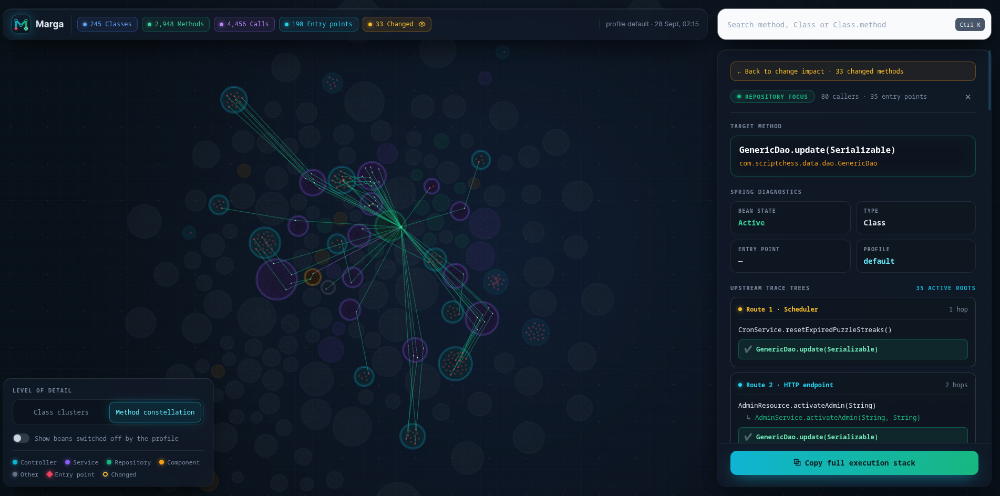

# Marga Maven Plugin

**Marga** (Sanskrit for *path*) scans the compiled classes of a Maven project — including every
module in a multi-module reactor — and generates an **interactive method call graph** as a
self-contained HTML report. With an optional git diff, it also performs **change impact analysis**:
which entry points and methods are affected by your uncommitted or branch changes.

It works directly on compiled `.class` bytecode (via [ASM](https://asm.ow2.io/)), so it needs no
source parsing, no running application, and no special compiler setup — just `mvn compile` output.

## Features

- **Static call graph** of all compiled classes across all reactor modules — direct calls,
  lambda/method-reference calls, and virtual dispatch edges are distinguished.
- **Spring-aware**: recognizes `@Controller`, `@Service`, `@Repository`, `@Component`,
  `@Bean` methods, constructor/field injection, interfaces and overrides, and local/anonymous
  classes (lambda bodies are attributed to their enclosing method).
- **Profile-aware**: evaluates Spring `@Profile` expressions (`prod`, `!prod`,
  `dev & (eu | us)`, `|`, `&`, parentheses) and marks beans as active, inactive, or conditional
  for the active profile set.
- **Interactive HTML report** — a [Cytoscape.js](https://js.cytoscape.org/)-based viewer with
  search, overview, and light/dark theme, fully self-contained and openable via `file://`.
- **Shareable deep links** — the report reflects the current view in the URL hash
  (`#impact`, `#method=<id>`, `#class=<id>`), so any focus state can be bookmarked or shared,
  and the browser's Back/Forward buttons navigate report views.
- **Change impact analysis** — map a git diff onto changed methods, then walk callers to compute
  the impact radius. Results are shown in the report and emitted as `impact.json` / `impact.md`
  for CI pipelines and pull-request comments.
- **Large-codebase friendly** — the graph is stored in compact array-based form and the report
  data is chunked and loaded lazily, so it scales to big codebases.

## Requirements

- **JDK 17+** (the plugin itself is compiled with `--release 17`)
- **Apache Maven 3.9.0+**
- **Git 2.30+** — only for impact analysis with `-Dmarga.diffBase` (needed for `--merge-base`)

## Getting started

Marga is published to [Maven Central](https://central.sonatype.com/artifact/com.scriptchess/marga-maven-plugin),
so add it as a build plugin in the project you want to analyze:

```xml
<plugin>
  <groupId>com.scriptchess</groupId>
  <artifactId>marga-maven-plugin</artifactId>
  <version>1.0.2</version>
</plugin>
```

> **Important — declare it in the root POM.**
> Marga's goal is an **aggregator goal**: declare it in the **root (parent/aggregator)
> `pom.xml`** of your project, not in a child module. The goal iterates over *every* module of
> the reactor (`session.getProjects()`) and scans each module's compiled classes into a single
> graph, so it needs the root project's view of the build. It is also always invoked once per
> reactor, and all paths it resolves are relative to the **execution root** — the report is
> written to the root `target/marga/`, not a module's own `target/`.
>
> For the same reason, **run it from the root** — execute `mvn ... marga:graph` in the directory
> that holds the root POM — so the whole reactor is available and the working directory used for
> `git diff` is the repository root rather than a submodule.

Then run it:

```bash
mvn compile marga:graph
```

(`mvn install marga:graph` also works, but compiling is all it needs. If the short `marga:`
prefix isn't resolved, either add `<pluginGroup>com.scriptchess</pluginGroup>` to your
`settings.xml` or invoke the goal fully qualified:
`mvn compile com.scriptchess:marga-maven-plugin:1.0.2:graph`.)

Open the generated report:

```
target/marga/index.html
```

A complete root-POM setup with the plugin configured looks like this:

```xml
<project>
  <!-- ... -->
  <build>
    <plugins>
      <plugin>
        <groupId>com.scriptchess</groupId>
        <artifactId>marga-maven-plugin</artifactId>
        <version>1.0.2</version>
        <configuration>
          <!-- all optional; also settable from the command line, e.g. -Dmarga.diffBase=origin/main -->
          <diffBase>origin/main</diffBase>
          <outputDirectory>${project.build.directory}/marga</outputDirectory>
          <skip>false</skip>
        </configuration>
      </plugin>
    </plugins>
  </build>
</project>
```

## How to use

### 1. Run the scan

From the root of your project (single- or multi-module — every reactor module is scanned):

```bash
mvn compile marga:graph
```

Marga parses the compiled `.class` files of each module, builds the call graph and writes the
report to `target/marga/`. Then open `target/marga/index.html` in a browser — no web server
needed, it works straight from the filesystem.

### 2. Explore the report

The interactive viewer lets you:

- **Search anything** — press <kbd>Ctrl</kbd>+<kbd>K</kbd> and type a method, class, or
  `Class.method` name.
- **Inspect a method** — click any node to see its callers, callees, and which entry points
  (controllers, `@Scheduled` jobs, listeners, …) it can be reached from.
- **Switch granularity** — toggle between *Class clusters* and *Method constellation* views in
  the bottom-left control panel.
- **Consider profiles** — beans switched off by the current Spring profile are hidden by
  default; enable *Show beans switched off by the profile* to include them.
- **Share a view** — every focus state is reflected in the URL (`#method=<id>`, `#class=<id>`,
  `#impact`), so you can link colleagues straight to a method, and the browser Back button
  navigates between views.

### 3. Check the impact of your changes

Marga's impact analysis needs a diff. You provide it in one of two ways, controlled by two
properties:

| Property         | What it does                                                                                  | Needs git? |
|------------------|-----------------------------------------------------------------------------------------------|------------|
| `marga.diffBase` | A git ref (branch, tag, commit, `origin/main`, `HEAD~3`, …). Marga runs `git diff --merge-base <ref>` itself, comparing that ref's **merge base** against your **working tree**, so **committed and uncommitted changes are both included**. | Yes — and **git 2.30+** for `--merge-base`. |
| `marga.diffFile` | Path to an **already-produced unified diff** file. Marga reads it instead of running git, so this works with no git repo present (e.g. a `.patch` generated by CI or GitHub's API). The file name is shown as the comparison label in the report. | No. |

Only one is needed; if **both** are supplied, `marga.diffFile` takes precedence. With neither,
Marga just writes the call-graph report and skips impact analysis.

#### Via the command line

```bash
# diffBase: compare your working tree against a git ref
mvn compile marga:graph -Dmarga.diffBase=origin/main

# any ref works: a tag, a commit sha, or a relative ref
mvn compile marga:graph -Dmarga.diffBase=v1.4.0
mvn compile marga:graph -Dmarga.diffBase=HEAD~3

# diffFile: use a pre-generated unified diff instead
git diff origin/main > changes.patch
mvn compile marga:graph -Dmarga.diffFile=changes.patch

# absolute paths are fine too
mvn compile marga:graph -Dmarga.diffFile=/tmp/ci/changes.patch
```

The diff file must be a **unified diff** (the default `git diff` format; `--unified=0` is applied
automatically when Marga runs git itself). Context-only or `--stat` output cannot be mapped.

#### Via `pom.xml`

Configure it once in the root POM so the goal picks it up whenever it runs:

```xml
<plugin>
  <groupId>com.scriptchess</groupId>
  <artifactId>marga-maven-plugin</artifactId>
  <version>1.0.2</version>
  <configuration>
    <!-- one of the two; remove the one you don't use -->
    <diffBase>origin/main</diffBase>
    <diffFile>${project.basedir}/changes.patch</diffFile>
  </configuration>
</plugin>
```

Because the parameters are declared with `property = "marga.diffBase"` / `marga.diffFile`,
**command-line `-D` values always override the POM**. That makes a good default possible: pin a
baseline in the POM and override it per run, e.g.

```bash
mvn compile marga:graph -Dmarga.diffBase=release/2.3      # overrides the POM's value
```

#### What you get

The report opens directly on the **impact view**: your changed methods plus everything that
transitively calls them, with affected entry points highlighted. The same information is written
machine-readably to `target/marga/impact.json` and `target/marga/impact.md` for CI and PR comments.

### 4. Automate it in CI

Because Marga only needs compiled classes and an optional diff, it fits into any pipeline:

```bash
# e.g. GitHub Actions, inside a PR build
- run: mvn compile marga:graph -Dmarga.diffBase=origin/${{ github.base_ref }}
- run: cat target/marga/impact.md >> $GITHUB_STEP_SUMMARY   # or post it as a PR comment
```

Tip: to annotate a PR from a different job or workflow, create the diff once
(`git diff origin/main > changes.patch`), pass it with `-Dmarga.diffFile=changes.patch`, and
attach `impact.json` / `impact.md` as build artifacts.

### 5. Handy recipes

| I want to…                                     | Do this                                                                 |
|------------------------------------------------|-------------------------------------------------------------------------|
| Understand how a request is handled internally | Run `mvn compile marga:graph`, search the controller method, follow its callers/callees. |
| Know if my uncommitted work is safe            | `mvn compile marga:graph -Dmarga.diffBase=origin/main`                  |
| Review someone else's PR                       | `git diff main...pr-branch > pr.patch && mvn compile marga:graph -Dmarga.diffFile=pr.patch` |
| Skip the analysis on jobs that don't need it   | `mvn compile marga:graph -Dmarga.skip=true`                             |

All `-Dmarga.*` properties are listed in [Configuration](#configuration).

## Results

Marga's interactive report visualizes the call graph across three primary states:

### 1. Impact view
Shows the impact of changes based on the provided `marga.diffBase` or `marga.diffFile` configuration. This is also the default state of the report when a diff is available. It highlights changed methods, traces all callers transitively, and flags affected entry points.



### 2. Overview
Shows the full overview when nothing is selected — displaying the class and method constellation along with metadata and very slightly visible connecting lines between related components.



### 3. Selection view
Shows how a specific method is reached from different entry points or methods, tracing incoming callers and outgoing invocations with clear visual paths and details in the side panel.



## Change impact analysis

Impact analysis is driven by `marga.diffBase` or `marga.diffFile` — see
[Check the impact of your changes](#3-check-the-impact-of-your-changes) for how to set each of
them (command line or POM) and how they differ. When a diff is provided, Marga:

1. maps each changed line onto the method(s) that own it (lambda bodies count as their enclosing
   method; blank/comment lines are ignored);
2. walks the caller graph from every changed method to compute the impact radius;
3. highlights impacted methods and affected entry points in the HTML report;
4. writes `impact.json` and `impact.md` next to the report for CI consumption and PR comments.

Without `-Dmarga.diffBase` / `-Dmarga.diffFile`, only the call graph report is generated.

## Configuration

All properties are optional and can be set either as `<configuration>` entries in the root POM
(element name = property name, e.g. `<diffBase>`) or on the command line with `-D` (e.g.
`-Dmarga.diffBase=origin/main`). Command-line values override the POM.

| Property                | Default                            | Description                                       |
|-------------------------|------------------------------------|---------------------------------------------------|
| `marga.outputDirectory` | `${project.build.directory}/marga` | Where the report and data files are written.      |
| `marga.skip`            | `false`                            | Set to `true` to skip execution.                  |
| `marga.diffBase`        | —                                  | Git ref to diff against (e.g. `origin/main`). Runs `git diff --merge-base`; see [Check the impact of your changes](#3-check-the-impact-of-your-changes). |
| `marga.diffFile`        | —                                  | Path to a unified diff file instead of running `git diff`; takes precedence over `diffBase`. |

## Output layout

```
target/marga/
├── index.html          interactive call graph viewer
├── scan.json           raw scan result (debug output)
├── impact.json         impact analysis result (only with a diff)   [JSON, for CI]
├── impact.md           same impact, rendered as Markdown         [for PR comments]
└── data/
    ├── manifest.js     counts, chunk index, format version
    ├── core.js         graph topology (always loaded)
    ├── search.js       method names for search
    ├── overview.js     class-to-class call counts (lazy)
    ├── sig-NNN.js      parameter lists per package group (lazy)
    └── impact.js       changed methods of the diff (only with a diff)
```

The data files are plain `<script>` payloads, so the report works when opened directly from the
filesystem — no web server required.

## How it works

1. **Scan** — `MargaClassFileScanner` walks each module's `target/classes` and parses every
   `.class` file with ASM (`MargaClassVisitor` / `MargaMethodVisitor`), collecting the class
   hierarchy, annotations, `@Profile` values, source-file mappings and per-method call sites.
2. **Build** — `CallGraphBuilder` resolves call sites into a compact, array-based `CallGraph`
   record with forward/reverse edges, override/implementation links, and class-level edge pairs.
   Spring bean stereotypes and profile activity are resolved here.
3. **Analyze** (optional) — `ImpactAnalyzer` maps diff lines onto methods and walks reverse
   (caller) edges to find the impact radius.
4. **Report** — `ReportWriter` renders everything into the HTML template with embedded
   Cytoscape.js, chunked and lazily loaded data files, plus optional `impact.json` / `impact.md`.

## Development

```bash
mvn install        # build, run tests, install locally
mvn -Prelease clean deploy   # sources + javadoc + GPG signing, publish to Maven Central
```

Releases are automated: pushing a `v*` tag (e.g. `v1.0.2`) triggers the
[release workflow](.github/workflows/release.yml), which builds, signs and deploys the plugin
to the Central Portal.

Project layout:

```
src/main/java/com/scriptchess/marga/
├── mojo/       Maven goal (marga:graph)
├── scanner/    class-file discovery
├── visitors/   ASM class/method visitors
├── scan/       scan result model (classes, methods, call sites)
├── graph/      call graph construction (records, profile evaluation)
├── impact/     git diff + change impact analysis
└── report/     HTML report generation
```

## Status

`1.0.2` — published to Maven Central. See the
[release notes](https://github.com/kgcorner/marga/releases) for changes between versions.

## License

[Apache License 2.0](https://www.apache.org/licenses/LICENSE-2.0)